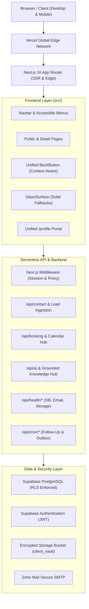

# System Architecture Audit — Logic Intelligence Technologies

**Company:** Logic Intelligence Technologies  
**Production Domain:** https://www.logicintelligencetechnologies.in  
**Architecture Model:** Next.js App Router (Hybrid Server/Client Components) with Supabase Edge Services  

---

## 1. System Topology



---

## 2. Directory Layout & Organization

```
src/
├── app/                  # Next.js App Router Pages & API routes
│   ├── (auth)/           # Authentication routes (/login, /reset-password)
│   ├── (marketing)/      # Public corporate, solutions, work, and resource pages
│   ├── (portal)/         # Authenticated customer workspace (/profile)
│   ├── admin/            # Role-restricted command center & CRM
│   ├── api/              # Secure backend serverless handlers
│   └── client/           # Client portal subviews & legacy redirects
├── components/           # Reusable UI Primitives
│   ├── layout/           # PageShell, PageHeader, PageSection, ContentContainer, FinalCTA
│   ├── media/            # ResponsiveImage, HeroImage, FounderImage, ImageFallback
│   ├── navigation/       # BackButton, Breadcrumbs, MoreMenu, MobileMenu, RouteAnnouncer
│   └── ui/               # Button, GlassSurface, BrandMesh, Accordion
├── config/               # Single-source-of-truth configuration modules
│   ├── company.ts        # Official company identity, founder info, contacts
│   ├── founder.ts        # Verified founder biography and credentials
│   ├── navigation.ts     # Primary and More navigation definitions
│   ├── pdfs.ts           # 12 verified corporate publication specifications
│   ├── routes.ts         # Centralized route catalog and back button mappings
│   ├── profile.ts        # Unified profile tabs and update schema
│   ├── email.ts          # Email provider and notification settings
│   ├── legal.ts          # Terms, privacy, and regulatory policies
│   └── seo.ts            # Canonical schemas and Open Graph metadata
└── lib/                  # Server-side clients, sanitizers, and validation logic
```

---

## 3. Account & Route Architecture Decisions

1. **Unified Authentication Entry Point (`/login`)**:
   - Single canonical login page supporting email/password, magic link, and password resets.
   - Redirects authenticated visitors to `/profile` (or internal `/dashboard`).
   - Legacy route `/client/login` is permanently redirected (HTTP 301/308) to `/login`.

2. **Unified Account Management (`/profile`)**:
   - Single canonical destination for authenticated profile management.
   - Combines personal details, security settings, encrypted document vault, invoices, sprint progress, and support tickets into an accessible tabbed interface.
   - Legacy route `/client/profile` is permanently redirected (HTTP 301/308) to `/profile`.

3. **Context-Aware Navigation (`<BackButton />`)**:
   - Unified component located at `src/components/navigation/BackButton.tsx`.
   - Replaced fragmented and hardcoded back links across the entire application with deterministic fallback destinations.
